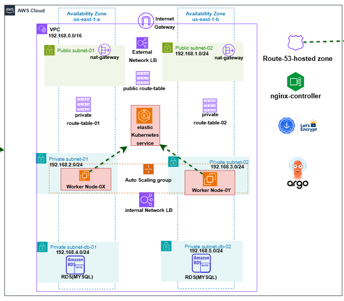

# Terraform EKS & Database Deployment

This repository contains the infrastructure-as-code (IaC) setup using **Terraform** to deploy a complete AWS environment, including VPC, EKS (Kubernetes), RDS database, and DNS. The deployment is automated using **GitHub Actions**.

---

## 📁 Project Structure

```bash
bank-infra/
├── .github/workflows/          # GitHub Actions CI/CD workflows for Terraform plans/applies
├── docker-git-runner-setup/    # Optional: Docker setup for a self-hosted GitHub runner
├── module-vpc/                 # Terraform module to provision VPC and networking
├── module-eks/                 # Terraform module to deploy an EKS cluster
├── module-database/            # Terraform module to deploy RDS databases
├── module-dns/                 # Terraform module for Route53/DNS setup
├── .terraform.lock.hcl         # Provider and dependency lock file
├── .tflint.hcl                 # Terraform linting configuration
├── 01-provider.tf              # AWS provider configuration
├── backend.tf                  # Remote state configuration (e.g., S3/DynamoDB/Terraform Cloud)
├── main.tf                     # Root module wiring the VPC, EKS, DB, and DNS modules
├── output.tf                   # Root outputs (cluster endpoint, DB endpoint, etc.)
├── terraform.tfvars            # Variable values for the root module
├── variable.tf                 # Variable definitions for the root module
└── readme.MD                   # Project documentation (you are here)
```

## 🏗️ Architecture


